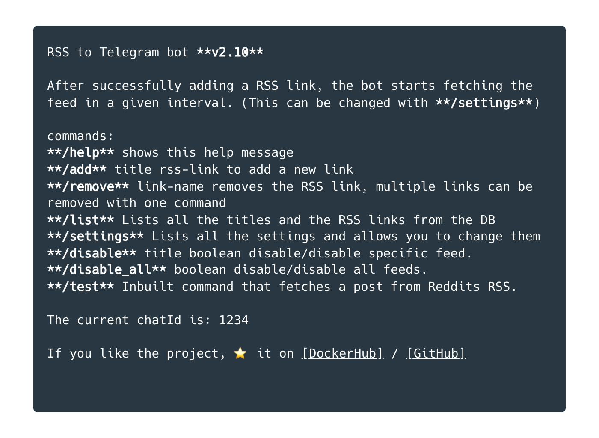

     
# RSS to Telegram bot

A self-hosted telegram JavaScript/TypeScript bot that dumps posts from RSS feeds to a telegram chat. 
This script was created because all the third party services were unreliable.



### Docker

For the docker image go to: https://hub.docker.com/r/bokker/rss.to.telegram/

### Installation

Dont forget to use the right node version. `nvm use` or match the version in `.nvmrc`

```sh
npm install
cp .env.example .env
npm run dev
```

Dont forget to fill the .env file

A telegram bot is needed that the script will connect to. https://botsfortelegram.com/project/the-bot-father/
Running the script and typing in /help will reveal all the commands

1. Clone the script
2. Save and run
3. Use the telegram commands to manage feeds

# Known issues

There are no known issues but the telegram API has limitations on how many messages per chat you can receive

# Docker

```
docker create \
  --name=rss.to.telegram \
  -e TOKEN=InsertToken \
  -e DEBUG=false \
  -v /path/to/host/config:/app/config \
  --restart unless-stopped \
  bokker/rss.to.telegram
```
